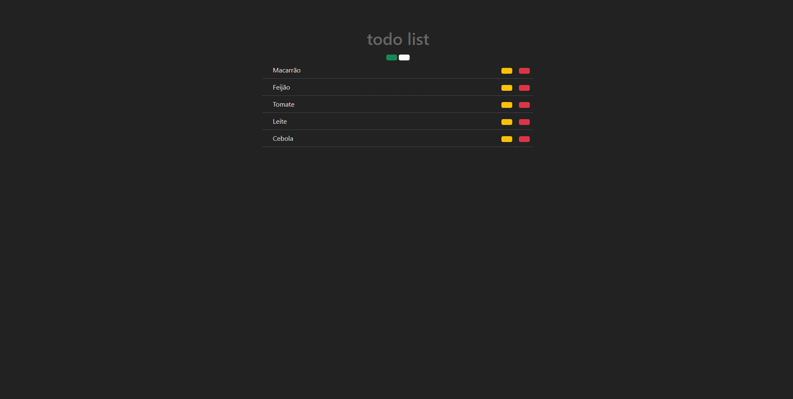

<p align="center">
  A minimalist todo list with php mysql.
</p>

<!-- <p align="center">
  Live Preview: https://todo-app.carlospessin.vercel.app/
</p> -->

---

<p align="center">
  
</p>

#### :information_source: How to use

```bash

# Clone repository
$ https://github.com/carlospessin/todo-list

```

#### :memo: License

This project is under the MIT license - See the file [LICENSE.md](https://github.com/carlospessin/todo-app/blob/master/LICENSE.md) for details.
